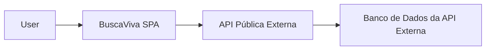
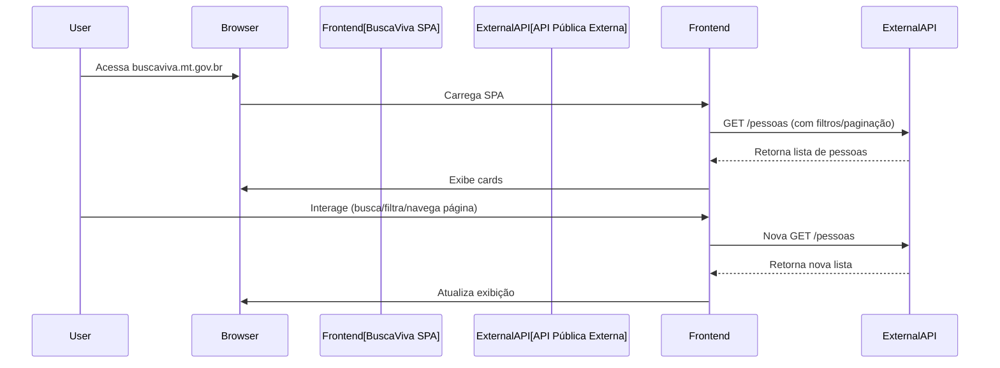
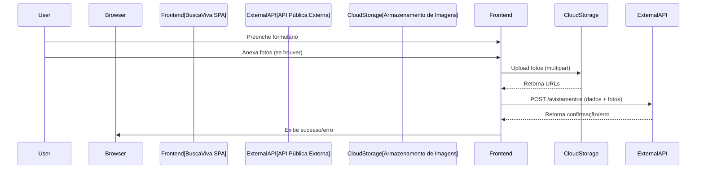

# Arquitetura do Sistema - BuscaVivaMT  

Este documento descreve a arquitetura do sistema BuscaViva, focando na estrutura do frontend e sua interação com a API externa pública. Nosso objetivo é construir um frontend robusto, escalável e de fácil manutenção.

## 1. Visão Geral da Arquitetura

O BuscaViva é uma **Single Page Application (SPA) React** que se comunica diretamente com uma API pública externa.



**Explicação:**

- **User:** Representa o cidadão que acessa e interage com o sistema.  
- **Frontend (BuscaViva SPA):** É a aplicação que estamos construindo. Responsável pela interface do usuário, lógica de apresentação e comunicação com a API externa.  
- **External API (API Pública Externa):** API já existente e fornecida pela Polícia Judiciária Civil de Mato Grosso.  
- **Database (Banco de Dados da API Externa):** Banco gerenciado pela API externa (fora do escopo do frontend).  

---

## 2. Stack Tecnológica

**Frontend**

- Framework: React 18.x  
- Linguagem: TypeScript  
- UI Library: Tailwind CSS  
- Gerenciamento de Estado (Local): React Context API / useState  
- Gerenciamento de Estado (Servidor): TanStack Query (cache/sincronização com API)  
- Roteamento: React Router v6  
- Formulários: React Hook Form + Zod  
- HTTP Client: Axios  
- Mapas: Leaflet + React-Leaflet  
- Build Tool: Vite  
- Containerização: Docker (deployment do frontend)  

---

## 3. Estrutura de Pastas

A arquitetura do código seguirá o modelo **Feature-Based**, com camadas para reutilização e separação de responsabilidades.

```
buscaviva/
├── src/
│   ├── assets/       # Imagens, fontes, ícones (locais)
│   ├── components/   # Componentes reutilizáveis (UI genérica)
│   │   ├── common/   # Componentes globais (Header, Footer)
│   │   ├── ui/       # Componentes básicos (Button, Input)
│   ├── features/     # Funcionalidades (PersonCard, ReportForm, SearchBar)
│   │   ├── auth/     # (Se houver autenticação no futuro)
│   ├── hooks/        # Custom hooks globais (useDebounce, useApi)
│   ├── lib/          # Configurações de libs (axios, react-query)
│   ├── pages/        # Páginas/Rotas (Home, PersonDetail, NotFound)
│   ├── services/     # Serviços de API (clients, endpoints)
│   ├── store/        # Estado global (Context/Zustand, se necessário)
│   ├── styles/       # Estilos globais (Tailwind CSS)
│   ├── types/        # Tipos TypeScript (interfaces API/frontend)
│   ├── utils/        # Funções utilitárias (formatadores, validadores)
│   ├── App.tsx       # Componente raiz
│   └── main.tsx      # Entry point
├── public/           # Arquivos estáticos
├── docs/             # Documentação
├── tests/            # Configuração/utilitários de testes
├── .env.example      # Exemplo variáveis ambiente
├── .eslintrc.cjs     # ESLint config
├── .gitignore        # Ignore Git
├── index.html        # HTML principal
├── package.json      # Dependências e scripts
├── README.md         # Documentação repositório
├── tailwind.config.js# Configuração Tailwind
├── tsconfig.json     # Configuração TypeScript
├── vite.config.ts    # Configuração Vite
└── Dockerfile        # Configuração Docker
```

---

## 4. Gerenciamento de Estado

- **Estado do Servidor (Server State):** Gerenciado por **TanStack Query** (React Query), incluindo caching, revalidação, sincronização e tratamento de erros.  
- **Estado da UI (Client State):** Estados simples e globais (tema, configs) via **React Context API** ou `useState`.  

---

## 5. Fluxo de Dados (Exemplo)

### Consulta de Pessoas (Home Page)



### Reporte de Avistamento (Formulário)



---

## 6. Segurança

Medidas adotadas:

- **HTTPS:** Todas as comunicações via HTTPS.  
- **Validação de Input:** Prevenção de envio de dados inválidos/maliciosos.  
- **XSS Prevention:** React protege contra XSS por padrão; evitar `dangerouslySetInnerHTML`.  
- **Sanitização:** Sanitizar dados recebidos da API antes da renderização.  
- **Upload de Arquivos:** Validação de tipo/tamanho antes do upload.  
- **Controles de Cache:** Uso de headers + TanStack Query para evitar re-fetching desnecessário.  
- **Privacidade:** Sem armazenamento local de dados sensíveis.  

---

## 7. Deployment

- **Estratégia:** Docker + Nginx para servir build otimizado do React.  
- **CI/CD:** GitHub Actions para build, testes e deploy contínuo.  
