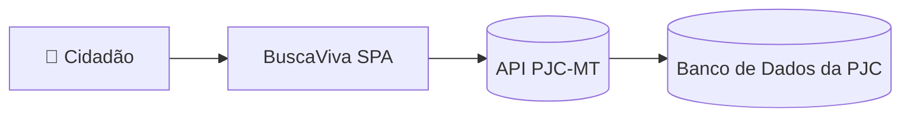
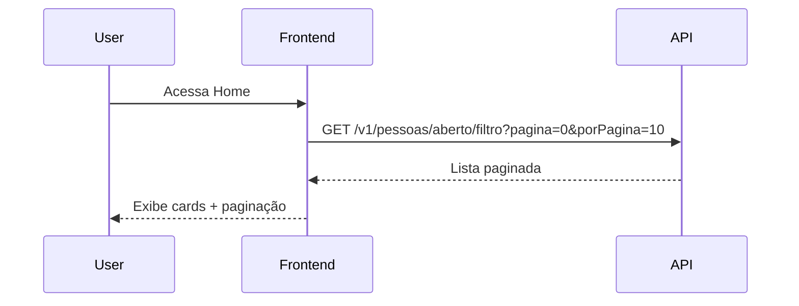
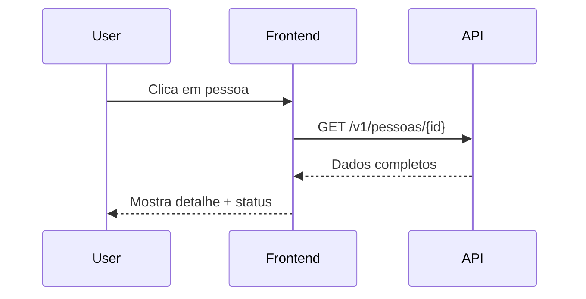

# Arquitetura do Sistema - BuscaVivaMT

Este documento descreve a arquitetura do sistema **BuscaVivaMT**, com foco na estrutura do frontend e sua interação com a API externa pública disponibilizada pela Polícia Judiciária Civil do Estado de Mato Grosso.

---

## 1. Visão Geral

O BuscaVivaMT é uma **Single Page Application (SPA)** desenvolvida em **React + TypeScript**, comunicando-se diretamente com a API oficial `https://abitus-api.geia.vip`.



**User**: qualquer cidadão acessando a aplicação.  
**Frontend**: nossa SPA (UI, estado, validação, acessibilidade, segurança).  
**API PJC-MT**: fornece dados de pessoas desaparecidas e recebe informações/avistamentos.  
**Database**: gerenciado pela própria PJC, fora do escopo.

---

## 2. Stack Tecnológica
- Framework: React 18
- Linguagem: TypeScript
- Estilização: Tailwind CSS
- Roteamento: React Router v6 (Lazy Loading)
- Gerenciamento de estado servidor: TanStack Query
- Formulários: React Hook Form + Zod
- HTTP Client: Axios
- Mapas: Leaflet + React-Leaflet
- Build Tool: Vite
- Containerização: Docker + Nginx

---

## 3. Estrutura de Pastas

```cpp
buscaviva/
├── src/
│   ├── assets/        # imagens, ícones
│   ├── components/    # componentes UI globais
│   ├── features/      # funcionalidades (Home, Detalhe, ReportForm)
│   ├── hooks/         # custom hooks (useDebounce, useAuth)
│   ├── lib/           # configs (axios, react-query)
│   ├── pages/         # páginas/rotas
│   ├── services/      # chamadas à API (personService, reportService)
│   ├── styles/        # estilos globais
│   ├── types/         # interfaces TS
│   └── utils/         # formatadores e helpers
├── public/            # arquivos estáticos
├── docs/              # documentação
├── tests/             # testes unitários/e2e
├── .env.example       # variáveis ambiente
├── Dockerfile         # build container
└── ...
```

---

## 4. Fluxo de Dados

### 4.1 Consulta de Pessoas (Home)


### 4.2 Detalhe de Pessoa


### 4.3 Reportar Avistamento (multipart direto)
```mermaid
sequenceDiagram
    User->>Frontend: Preenche formulário (informacao, descricao, data, ocoId, fotos)
    Frontend->>API: POST /v1/ocorrencias/informacoes-desaparecido
        Query: informacao, descricao, data, ocoId
        Body: multipart/form-data (files[])
    API-->>Frontend: Confirmação de recebimento
    Frontend-->>User: Mensagem de sucesso
```

---

## 5. Segurança
- HTTPS only
- CSP restrita (conexão apenas com abitus-api.geia.vip)
- Permissions-Policy: geolocation=(self)
- Validação de entrada: Zod + máscaras (telefone, datas)
- Upload: validação de tipo/tamanho antes do FormData
- Privacidade: não persistir dados pessoais no front

---

## 6. Deployment
- Build: `vite build` → artefatos estáticos (/dist)
- Container: Docker multi-stage
- Servidor: Nginx, SPA fallback + headers de segurança

**Exemplo de nginx.conf:**
```nginx
server {
  listen 80;
  root /usr/share/nginx/html;

  location / {
    try_files $uri /index.html;
  }

  add_header X-Frame-Options "SAMEORIGIN";
  add_header X-Content-Type-Options "nosniff";
  add_header Referrer-Policy "strict-origin-when-cross-origin";
  add_header Permissions-Policy "geolocation=(self)" always;

  add_header Content-Security-Policy "default-src 'self';
    connect-src 'self' https://abitus-api.geia.vip;
    img-src 'self' data:;
    style-src 'self' 'unsafe-inline';
    script-src 'self';
    font-src 'self' data:;
    frame-ancestors 'none';";
}
```
