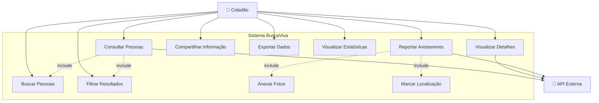

# Caso de Uso - BuscaViva

## 📋 Visão Geral

Este documento detalha todos os casos de uso do sistema BuscaViva, descrevendo as interações entre os usuários e o sistema.

## 👥 Atores

### Ator Principal
- **Cidadão:** Qualquer pessoa que acessa o sistema publicamente

### Atores Secundários
- **Sistema API:** API externa da Polícia Civil
- **Sistema de Notificação:** Sistema de envio de alertas

## 📊 Diagrama de Casos de Uso

