# Caso de Uso - BuscaViva

## 📋 Visão Geral

Este documento detalha todos os casos de uso do sistema BuscaViva, descrevendo as interações entre os usuários e o sistema.

## 👥 Atores

### Ator Principal
- **Cidadão:** Qualquer pessoa que acessa o sistema publicamente

### Atores Secundários
- **Sistema API:** API externa da Polícia Civil
- **Sistema de Notificação:** Sistema de envio de alertas

## 📊 Diagrama de Casos de Uso

```mermaid
graph TB
    subgraph "Sistema BuscaViva"
        UC1[Consultar Pessoas]
        UC2[Visualizar Detalhes]
        UC3[Buscar Pessoas]
        UC4[Filtrar Resultados]
        UC5[Reportar Avistamento]
        UC6[Anexar Fotos]
        UC7[Marcar Localização]
        UC8[Compartilhar Informação]
        UC9[Exportar Dados]
        UC10[Visualizar Estatísticas]
    end
    
    Cidadao[👤 Cidadão]
    API[🔌 API Externa]
    
    Cidadao --> UC1
    Cidadao --> UC2
    Cidadao --> UC3
    Cidadao --> UC4
    Cidadao --> UC5
    Cidadao --> UC8
    Cidadao --> UC9
    Cidadao --> UC10
    
    UC1 -.include.-> UC3
    UC1 -.include.-> UC4
    UC5 -.include.-> UC6
    UC5 -.include.-> UC7
    
    UC1 --> API
    UC2 --> API
    UC5 --> API
```

