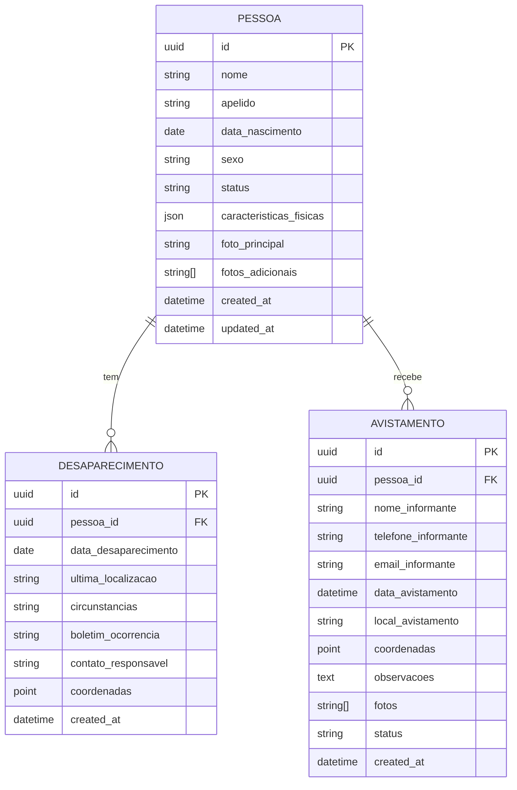

# Modelos de Dados - BuscaVivaMT

Este documento detalha os modelos de dados (schemas e interfaces TypeScript) utilizados no projeto BuscaVivaMT. Eles representam a estrutura das informações que transitam entre o frontend e a API.

## 1. Diagrama ER Simplificado



---

## 2. Interfaces TypeScript

### 2.1 Pessoa

```typescript
// src/types/person.ts

export interface Person {
  id: string;
  nome: string;
  apelido?: string;
  dataNascimento: string; // ISO 8601
  idade?: number; // Calculado no frontend
  sexo: 'M' | 'F' | 'O';
  status: 'DESAPARECIDO' | 'LOCALIZADO';
  fotoPrincipal?: string;
  fotosAdicionais?: string[];
  caracteristicasFisicas?: {
    altura?: number; // em cm
    peso?: number; // em kg
    corPele?: string;
    corCabelo?: string;
    corOlhos?: string;
    sinaisParticulares?: string;
  };
  desaparecimento?: {
    data: string; // ISO 8601
    ultimaLocalizacao: string;
    cidade: string;
    estado: string;
    circunstancias?: string;
    boletimOcorrencia?: string;
    coordenadas?: {
      lat: number;
      lng: number;
    };
  };
  contatoResponsavel?: {
    nome: string;
    telefone: string;
    relacao: string;
  };
  createdAt: string;
  updatedAt: string;
}
```

### 2.2 Avistamento/Report

```typescript
// src/types/report.ts

export interface ReportInput {
  pessoaId: string;
  informante: {
    nome: string;
    telefone: string;
    email?: string;
  };
  avistamento: {
    data: string; // ISO 8601
    local: string;
    cidade: string;
    estado: string;
    coordenadas?: {
      lat: number;
      lng: number;
    };
  };
  observacoes: string;
  fotos?: File[]; // Para upload
}

export interface ReportResponse {
  id: string;
  protocolo: string;
  status: 'PENDENTE' | 'EM_ANALISE' | 'VERIFICADO' | 'DESCARTADO';
  dataCriacao: string;
  mensagem: string;
}
```

### 2.3 Respostas da API

```typescript
// src/types/api.ts

// Resposta paginada genérica
export interface PaginatedResponse<T> {
  content: T[];
  pageable: {
    sort: {
      sorted: boolean;
      unsorted: boolean;
    };
    pageNumber: number;
    pageSize: number;
    offset: number;
    paged: boolean;
    unpaged: boolean;
  };
  totalElements: number;
  totalPages: number;
  last: boolean;
  first: boolean;
  numberOfElements: number;
  size: number;
  number: number;
  sort: {
    sorted: boolean;
    unsorted: boolean;
  };
  empty: boolean;
}

// Resposta de erro
export interface ApiError {
  timestamp: string;
  status: number;
  error: string;
  message: string;
  path: string;
}

// Parâmetros de busca
export interface SearchParams {
  nome?: string;
  cidade?: string;
  estado?: string;
  status?: 'DESAPARECIDO' | 'LOCALIZADO' | 'TODOS';
  idade?: {
    min?: number;
    max?: number;
  };
  dataDesaparecimento?: {
    inicio?: string;
    fim?: string;
  };
  page?: number;
  size?: number;
  sort?: string;
}
```

### 2.4 Formulários

```typescript
// src/types/forms.ts
import { z } from 'zod';

// Schema de validação para formulário de report
export const reportFormSchema = z.object({
  informante: z.object({
    nome: z.string().min(3, 'Nome deve ter pelo menos 3 caracteres'),
    telefone: z.string().regex(/^\(\d{2}\) \d{5}-\d{4}$/, 'Telefone inválido'),
    email: z.string().email('E-mail inválido').optional(),
  }),
  avistamento: z.object({
    data: z.string().datetime('Data inválida'),
    local: z.string().min(5, 'Local deve ter pelo menos 5 caracteres'),
    cidade: z.string().min(2, 'Cidade é obrigatória'),
    estado: z.string().length(2, 'Use a sigla do estado'),
    coordenadas: z.object({
      lat: z.number().min(-90).max(90),
      lng: z.number().min(-180).max(180),
    }).optional(),
  }),
  observacoes: z.string().min(20, 'Observações devem ter pelo menos 20 caracteres'),
});

export type ReportFormData = z.infer<typeof reportFormSchema>;

// Schema para busca
export const searchFormSchema = z.object({
  termo: z.string().optional(),
  cidade: z.string().optional(),
  estado: z.string().optional(),
  status: z.enum(['TODOS', 'DESAPARECIDO', 'LOCALIZADO']).optional(),
});

export type SearchFormData = z.infer<typeof searchFormSchema>;
```

---

## 3. Constantes e Enums

```typescript
// src/constants/index.ts

export const PERSON_STATUS = {
  MISSING: 'DESAPARECIDO',
  FOUND: 'LOCALIZADO',
} as const;

export const REPORT_STATUS = {
  PENDING: 'PENDENTE',
  ANALYZING: 'EM_ANALISE',
  VERIFIED: 'VERIFICADO',
  DISCARDED: 'DESCARTADO',
} as const;

export const ESTADOS_BR = [
  { sigla: 'AC', nome: 'Acre' },
  { sigla: 'AL', nome: 'Alagoas' },
  // ... outros estados
  { sigla: 'MT', nome: 'Mato Grosso' },
  // ... mais estados
] as const;

export const PAGINATION_DEFAULTS = {
  PAGE_SIZE: 10,
  INITIAL_PAGE: 0,
  SIZE_OPTIONS: [10, 20, 50],
} as const;
```

---

## 4. Tipos Utilitários

```typescript
// src/types/utils.ts

// Tipo para tornar propriedades opcionais
export type PartialBy<T, K extends keyof T> = Omit<T, K> & Partial<Pick<T, K>>;

// Tipo para status de loading
export type LoadingState<T> = 
  | { status: 'idle' }
  | { status: 'loading' }
  | { status: 'success'; data: T }
  | { status: 'error'; error: Error };

// Tipo para coordenadas
export interface Coordinates {
  lat: number;
  lng: number;
}

// Tipo para arquivo de upload
export interface UploadFile {
  file: File;
  preview: string;
  progress?: number;
  error?: string;
}
```

---

## 5. Mapeamento API <-> Frontend

```typescript
// src/utils/transformers.ts

import type { Person } from '@/types/person';

// Transforma resposta da API para modelo do frontend
export const apiToPerson = (apiData: any): Person => {
  return {
    id: apiData.id,
    nome: apiData.nome,
    apelido: apiData.apelido,
    dataNascimento: apiData.dataNascimento,
    idade: calculateAge(apiData.dataNascimento),
    sexo: apiData.sexo,
    status: apiData.status,
    fotoPrincipal: apiData.fotoPrincipal,
    fotosAdicionais: apiData.fotosAdicionais || [],
    caracteristicasFisicas: {
      altura: apiData.altura,
      peso: apiData.peso,
      corPele: apiData.corPele,
      corCabelo: apiData.corCabelo,
      corOlhos: apiData.corOlhos,
      sinaisParticulares: apiData.sinaisParticulares,
    },
    desaparecimento: apiData.desaparecimento ? {
      data: apiData.desaparecimento.data,
      ultimaLocalizacao: apiData.desaparecimento.ultimaLocalizacao,
      cidade: apiData.desaparecimento.cidade,
      estado: apiData.desaparecimento.estado,
      circunstancias: apiData.desaparecimento.circunstancias,
      boletimOcorrencia: apiData.desaparecimento.boletimOcorrencia,
      coordenadas: apiData.desaparecimento.latitude && apiData.desaparecimento.longitude ? {
        lat: apiData.desaparecimento.latitude,
        lng: apiData.desaparecimento.longitude,
      } : undefined,
    } : undefined,
    contatoResponsavel: apiData.contatoResponsavel,
    createdAt: apiData.createdAt,
    updatedAt: apiData.updatedAt,
  };
};

// Calcula idade baseada na data de nascimento
const calculateAge = (birthDate: string): number => {
  const today = new Date();
  const birth = new Date(birthDate);
  let age = today.getFullYear() - birth.getFullYear();
  const monthDiff = today.getMonth() - birth.getMonth();
  
  if (monthDiff < 0 || (monthDiff === 0 && today.getDate() < birth.getDate())) {
    age--;
  }
  
  return age;
};
```
